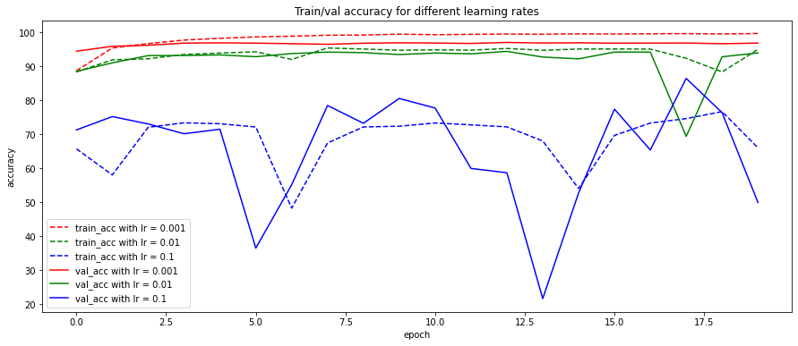

# Task 2d

We provide a completed run Jupyter notebook in HTML format at the root of the `/Permutated/` folder.

## Setup and execution

You need to download the permutated MNIST dataset as provided on [Ilias](https://ilias.unibe.ch/goto_ilias3_unibe_fold_1760165.html) and extract the csv files to the `ProjectRoot/data/mnist-permutated-png-format` folder, if not done already.

You should have the following structure : 
- `/data/mnist-permutated-png-format/`
  - `test/`
  - `train/`
  - `val/`
  
Then you need to install the required python modules to run the project. We suggest doing it in a virtualenv but you probably know that already.

For example at the root of the `Permutated/` folder : 
- `virtualenv venv`
- `source venv/Scripts/activate`
- `pip install -r requirements.txt`

You can then start the jupyter notebook using `jupyter notebook`, select the `cnn.ipynb` notebook and run the cells.

## Results

The accuracy on the test set was 
The model was training using different learning rates, after which we selected the one that yielded the best results on the validation set, which was $lr = 0.001$ (see Plot below).

We were surprised to see that without any modification to our CNN architecture, we were able to achieve such precision on the test set. 

We have a theory that our network does not have too many layers and uses small kernel sizes (size 3), which would allow for great generalization and can identify patterns even when placed "randomly" in the image. For example, if the images for the digit "1" always have a pixel in the very top right corner, the small convolution kernels will be able to discriminate using this parameter.

