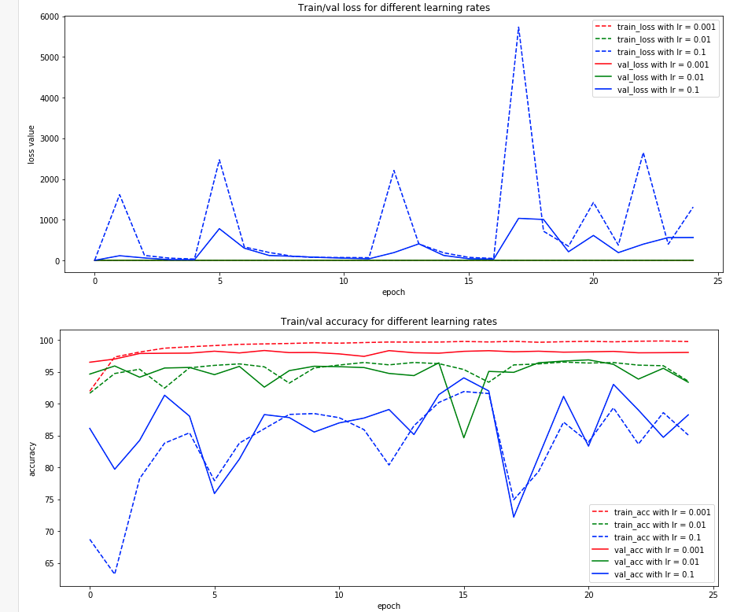

# PR_Course_Team
Repository for the team projects in the pattern recognition course, MCS 2020 UniFr. 
Team "chaussette".
## Task 2a

We provide a completed run Jupyter notebook in HTML format at the root of the `/SVM/` folder.
### Setup and execution

You need to download the MNIST dataset as provided on [Ilias](https://ilias.unibe.ch/goto_ilias3_unibe_fold_1760165.html) and extract the csv files to the `/SVM/data/` folder.

Then you need to install the required python modules to run the project. We suggest doing it in a virtualenv but you probably know that already.

For example at the root of the `SVM/` folder :
- `virtualenv venv`
- `source venv/Scripts/activate`
- `pip install -r requirements.txt`

You can then start the jupyter notebook using `jupyter notebook`, select the `svm.ipynb` notebook and run the cells.

### Results and observations

Using grid-search, we have found that the best kernel to use was the polynomial one, with degree 2. This resulted in an accuracy on the test set of **98.06 %**.

We wanted to try more hyper-parameters, but unfortunately, the computing time using the `GridSearchCV` of `sklearn` with **cross-validation** already took more than an hour and half.

A possible solution would be to reduce the size of the dataset, making sure the classes are balanced and computing on the subset.

## Task 2b - Multilayer perceptron

### Overview

The model is trained and tested with a lot of different values (125) for the following parameters:
- number of neurons (values = 20,40,60,80,100)
- learning rate (values = 0.02, 0.04, 0.06, 0.08, 0.1)
- training epochs (values = 200, 400, 600, 800, 1000).

### Best results

Best accuracy (92.08%) obtained with the following parameters:
- number of neurons = 100
- learning rate = 0.02
- training epochs = 800

**The following diagrams show the accuracy rate of the model with the best found parameters on the traing and validation set with respect to the training epochs**

**Green plot is the accuracy on the training set and the orange one is on the validation set.**

First iteration

Second iteration

Third iteration

Fourth iteration

Accuracy over epochs on training and test sets
For each epochs the accuracy is the max/average/stdev between each fold and each parameter combination (learning rate/number of neurons)

## Task 2c - Convolutional Neural Network

### Plots

### Best achieved accuracy
The maximum accuracy was achieved with lr = 0.001, on epoch 7 with 98.36% accuracy

## Task 2d - Permutated Dataset

### MLP - Multilayer Perceptron

Accuracy with standard images : 0.9745959595959596
Accuracy with permutated images : 0.9748484848484849

As we can see the model is has efficient in both cases. This is due to the fact that the order of the pixels in the images doesn't matter for this model.

If for example the pixel number 0 has the weight 0.1 and the pixel number 10 has the weight 0.7, when learnt with the standard dataset.

After swapping pixel number 0 and 10 in the permutated dataset, the weight learnt will be also swapped (but learn again, so maybe a bit different since we initialize randomly)

Another way of saying this, is that there is a 1-1 relationship between the position of the pixel and the weights value. So when swapping positions the optimal weights will follow the swap.

### CNN - Convolutional Neural Network

We provide a completed run Jupyter notebook in HTML format at the root of the `/Permutated/` folder.

#### Setup and execution

You need to download the permutated MNIST dataset as provided on [Ilias](https://ilias.unibe.ch/goto_ilias3_unibe_fold_1760165.html) and extract the csv files to the `ProjectRoot/data/mnist-permutated-png-format` folder, if not done already.

You should have the following structure : 
- `/data/mnist-permutated-png-format/`
  - `test/`
  - `train/`
  - `val/`
  
Then you need to install the required python modules to run the project. We suggest doing it in a virtualenv but you probably know that already.

For example at the root of the `Permutated/` folder : 
- `virtualenv venv`
- `source venv/Scripts/activate`
- `pip install -r requirements.txt`

You can then start the jupyter notebook using `jupyter notebook`, select the `cnn.ipynb` notebook and run the cells.

#### Results

The accuracy found on the test set was 95.91 %.
The model was trained using different learning rates, after which we selected the one that yielded the best results on the validation set, which was $lr = 0.001$ (see Plot below).

We were surprised to see that without any modification to our CNN architecture, we were able to achieve such precision on the test set. 

We have a theory that our network does not have too many layers and uses small kernel sizes (size 3), which would allow for great generalization and can identify patterns even when placed "randomly" in the image. For example, if the images for the digit "1" always have a pixel in the very top right corner, the small convolution kernels will be able to discriminate using this parameter.

